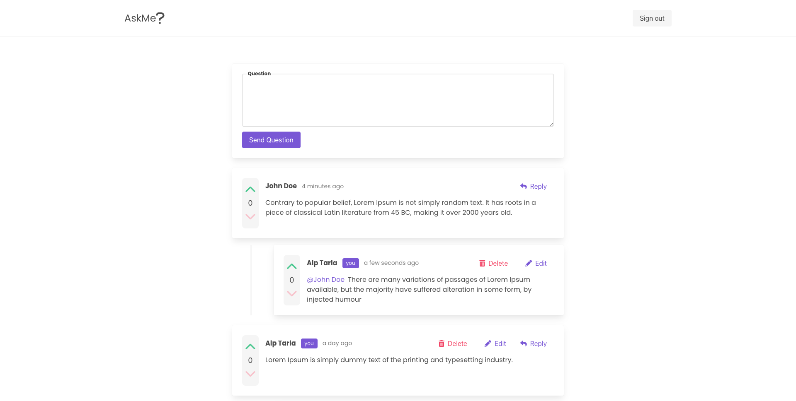

# Question/Answer App With Vue2

## Overview

### The challenge

Users should be able to:

- Login or register this app
- Ask question
- Edit and remove questions
- Reply questions
- Edit and remove answers
- Vote to questions or answers

### Screenshot

### Links

- Live Site URL: [ask-me](https://product-page-zeta.vercel.app/)

### Built with

- [Buefy](https://buefy.org/) - UI components for Vue.js based on Bulma
- [Vue](https://vuejs.org/) - JS Framework
- [Firebase](https://firebase.google.com) - Backend

### Notes

User credentials for test

- email - test@test.com
- password - test1234
